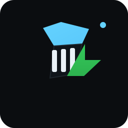

# badminton smash speed analyzer

made this cuz i wanted to know how fast my smashes actually are. turns out filming with your phone and some computer vision magic works pretty well.



## what is this

web app that calculates shuttlecock speed from video. you upload a vid, mark the court corners, and it does the rest. uses pytorch + yolo for detection, optical flow for tracking, kalman filtering for smoothing, and physics modeling for accuracy.

## quick start

### backend (python server)

```bash
cd backend
chmod +x run.sh
./run.sh
```

server runs on localhost:8000

or use docker:
```bash
cd backend
docker-compose up
```

### frontend (web interface)

just open `index-api.html` in your browser. or if that doesnt work:

```bash
python -m http.server 3000
```

then go to localhost:3000/index-api.html

## how to use

1. **upload video** - click choose video and pick your badminton smash vid
2. **calibrate** - click start calibration and mark the 4 court corners (top-left, top-right, bottom-right, bottom-left)
3. **analyze** - hit analyze video and wait a bit
4. **results** - get peak speed, average speed, and initial speed (physics-based estimate)

also shows a trajectory overlay and speed graph. can export to csv or png.

## filming tips

this thing works way better if you film correctly:

- **camera angle**: perpendicular to the court side. not at an angle. straight on.
- **height**: 2-3 meters high is good
- **frame rate**: 60fps minimum. 120fps or 240fps is way better.
- **lighting**: even lighting. no harsh shadows.
- **court visibility**: all 4 corners must be in frame
- **stability**: use a tripod or prop it on something stable
- **shuttle color**: white shuttle shows up better than colored ones

## accuracy

depends on your setup:
- 60fps: ±5-8 km/h
- 120fps: ±3-5 km/h
- 240fps: ±2-3 km/h

not professional hawkeye level but good enough to flex on your friends.

## tech stack

**backend:**
- python 3.11
- pytorch (yolov8 detection)
- opencv (video processing, optical flow)
- filterpy (kalman filtering)
- scipy (signal processing, optimization)
- fastapi (rest api)
- pydantic (validation)

**frontend:**
- vanilla js (no frameworks, keeping it simple)
- chart.js (graphs)
- custom scss (minimalist design)

## project structure

```
.
├── index-api.html          # web interface
├── app-api.js              # frontend logic
├── styles.css              # compiled css
├── scss/                   # scss partials
├── backend/
│   ├── app/
│   │   ├── core/           # detection, tracking, calibration, speed calc
│   │   ├── api/            # rest endpoints
│   │   ├── config.py       # settings
│   │   └── main.py         # fastapi app
│   ├── tests/              # pytest tests
│   ├── Dockerfile          # docker image
│   ├── docker-compose.yml  # docker setup
│   └── requirements.txt    # python deps
└── README.md               # this file
```

## how it works (simplified)

1. **calibration**: you click 4 court corners → creates homography matrix → maps pixels to real-world meters
2. **detection**: yolo finds the shuttle in each frame (or fallback to motion detection)
3. **tracking**: optical flow tracks shuttle between frames, kalman filter smooths it out
4. **speed calc**: measures distance traveled per frame, converts to m/s using calibration
5. **physics fit**: fits drag model `v(t) = v₀/(1+k*v₀*t)` to estimate initial speed

check `backend/README.md` for the deep technical explanation with all the math and stuff.

## custom yolo model

default yolo isnt trained on shuttles so if you want better accuracy you can train your own model. need like 1000+ labeled images. see backend readme for details.

## api docs

once backend is running, go to:
- swagger ui: http://localhost:8000/docs
- redoc: http://localhost:8000/redoc

## development

```bash
# backend
cd backend
make install        # install deps
make dev            # run dev server
make test           # run tests
make lint           # check code
make format         # format code

# frontend scss
npm install
npm run scss        # compile scss once
npm run scss:watch  # watch mode
```

## testing

```bash
cd backend
pytest
```

not 100% coverage but tests the important stuff.

## deployment

docker-compose setup is production-ready. has health checks, resource limits, proper logging, etc.

for cloud deployment id add nginx + ssl + monitoring but current setup works fine for local/personal use.

## known bugs

- tracking fails if shuttle goes behind net
- struggles with very fast shots at low fps
- motion detector gets confused by people moving in frame
- no multi-shuttle support (only tracks one shuttle)

## browser compatibility

works on:
- chrome/edge (recommended)
- firefox
- safari (mostly)

needs canvas api and fetch api so no ie11 lol.

## contributing

if you wanna improve this:
- better shuttle detection model
- better tracking algorithm
- support for multiple shuttles
- mobile app version
- real-time processing

feel free to fork and build on it.

## files explained

- `index.html` + `app.js` = old version that runs everything in browser (no backend)
- `index-api.html` + `app-api.js` = new version that uses python backend (way more accurate)
- `styles.css` = compiled from scss/
- `backend/` = python server with all the ml stuff

## why i built this

was playing badminton and kept wondering how fast my smashes were. saw those hawkeye tracking systems on youtube and thought "i bet i could build something similar". spent a few weeks learning computer vision and here we are.

not as accurate as professional systems but its free and works with just your phone camera so thats cool.

## shoutout

- ultralytics for yolov8
- opencv community
- everyone who helped me debug the calibration bug (that was a pain)

## license

MIT. do whatever you want with it.

---

if this helped you or you made something cool with it let me know. always down to see what people build.

also if you get a crazy high speed record send proof lol
